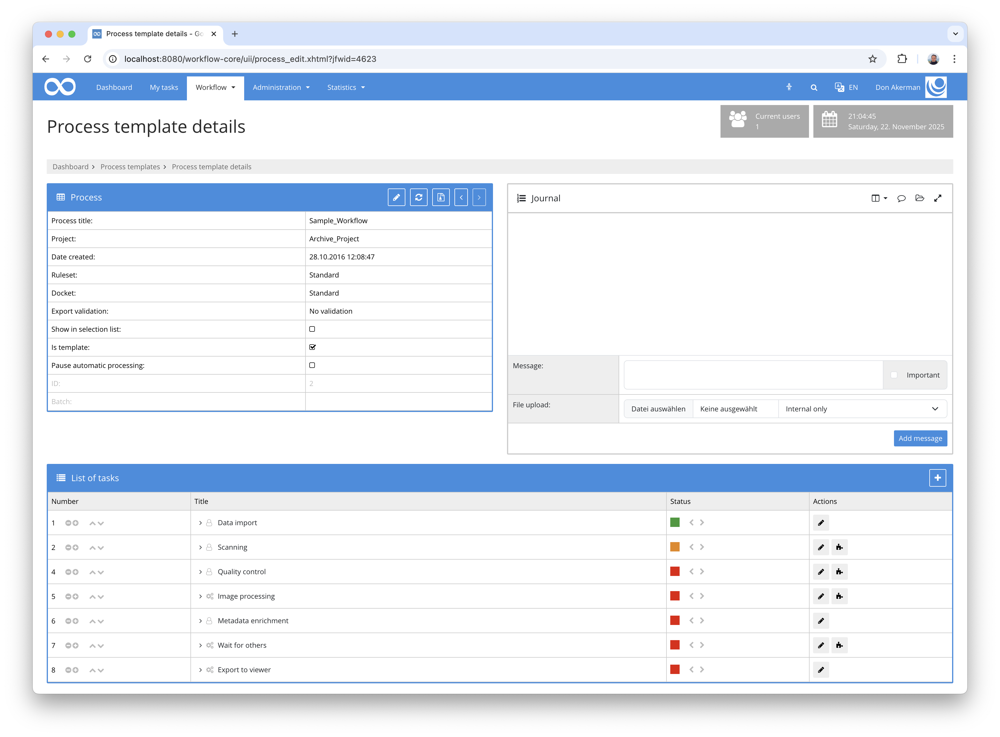
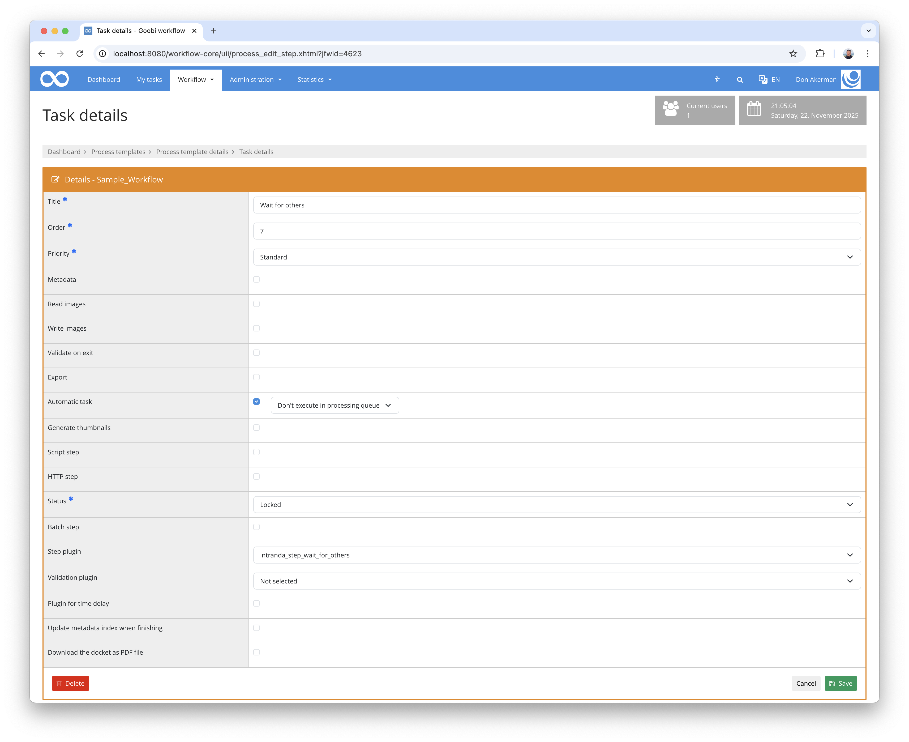

## Introduction
This documentation explains the plugin for ZZZ.

## Installation
To be able to use the plugin, the following files must be installed:

```bash
/opt/digiverso/goobi/plugins/step/plugin-step-ZZZ-base.jar
/opt/digiverso/goobi/plugins/GUI/plugin-step-ZZZ-gui.jar
/opt/digiverso/goobi/config/plugin_intranda_step_ZZZ.xml
```

Once the plugin has been installed, it can be selected within the workflow for the respective work steps and thus executed automatically. A workflow could look like the following example:



To use the plugin, it must be selected in a workflow step:




## Overview and functionality
ZZZ


## Configuration
The plugin is configured in the file `plugin_intranda_step_ZZZ.xml` as shown here:

{{CONFIG_CONTENT}}

{{CONFIG_DESCRIPTION_PROJECT_STEP}}

Parameter               | Explanation
------------------------|------------------------------------
``                      | 
``                      | 
``                      | 
``                      | 
``                      | 
``                      | 
``                      | 
``                      | 
``                      | 
``                      | 
``                      | 
``                      | 
``                      | 
``                      | 
``                      | 
``                      | 
``                      | 
``                      | 
``                      | 
``                      | 
``                      | 
``                      | 
``                      | 
``                      | 
``                      | 
``                      | 
``                      | 
